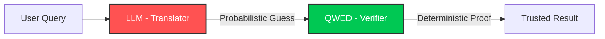

```
 ██████╗ ██╗    ██╗███████╗██████╗        █████╗ ██╗
██╔═══██╗██║    ██║██╔════╝██╔══██╗      ██╔══██╗██║
██║   ██║██║ █╗ ██║█████╗  ██║  ██║█████╗███████║██║
██║▄▄ ██║██║███╗██║██╔══╝  ██║  ██║╚════╝██╔══██║██║
╚██████╔╝╚███╔███╔╝███████╗██████╔╝      ██║  ██║██║
 ╚══▀▀═╝  ╚══╝╚══╝ ╚══════╝╚═════╝       ╚═╝  ╚═╝╚═╝
```

# QWED-AI: Query with Evidence and Determinism 🛡️

[](https://github.com/QWED-AI/qwed-verification/actions/workflows/ci.yml)
[](https://www.python.org/downloads/)
[](https://docker.com)
[](https://opensource.org/licenses/Apache-2.0)
[](https://redis.io)
[](https://prometheus.io)

> **The Deterministic Verification Protocol for AI.** QWED treats LLMs as untrusted translators and uses symbolic engines as trusted verifiers.

---

## 🆕 What's New in v2.0

| Engine | Upgrade | Impact |
|--------|---------|--------|
| **Math** | Calculus, Matrix, Finance, Statistics | 10x more use cases |
| **Logic** | ForAll/Exists quantifiers, BitVectors, Arrays | Crypto & formal proofs |
| **Code** | JavaScript, Java, Go support | 4 languages total |
| **SQL** | Complexity limits, Cost estimation | Production-ready |
| **Fact** | TF-IDF semantic matching | No LLM needed! |
| **Image** | Deterministic size verification | 100% accurate |
| **Consensus** | Async + Circuit breaker | Fault-tolerant |
| **Stats** | Wasm sandbox | Works anywhere |

---

## ⚡ Quick Start (30 Seconds)

```bash
# Install the SDK
pip install qwed-new

# Verify math instantly
qwed verify "Is 2+2=5?"
# -> ❌ CORRECTED: The answer is 4, not 5.

# Verify a logic puzzle
qwed verify-logic "(AND (GT x 5) (LT y 10))"
# -> ✅ SAT: {x=6, y=9}

# Verify code security
qwed verify-code -f script.py
# -> ⚠️ DANGEROUS: Found eval() on line 12
```

**That's it.** Deterministic verification in one line.

---

## 🎯 What QWED Does

QWED is a **verification firewall** that sits between your LLM and your business logic:



**The Problem:** LLMs hallucinate. `0.1 + 0.2 = 0.30000000004`.

**The Solution:** QWED uses **symbolic engines** (Z3, SymPy) to guarantee correctness.


---

## ✅ Features

| Feature | Status | Description |
|---------|--------|-------------|
| **8 Verification Engines** | ✅ | Math, Logic, Stats, Fact, Code, SQL, Image, Reasoning |
| **SQL Injection Firewall** | ✅ | AST-based parsing blocks `DROP`, `DELETE`, `; --` |
| **Distributed Caching** | ✅ | Redis-backed with automatic fallback |
| **Real-time Observability** | ✅ | Prometheus + Grafana dashboards |
| **Distributed Tracing** | ✅ | OpenTelemetry + Jaeger |
| **Multi-Tenancy** | ✅ | Per-organization isolation |
| **Rate Limiting** | ✅ | Redis sliding window |
| **Batch Processing** | ✅ | Up to 100 concurrent verifications |
| **Multi-Language SDKs** | ✅ | Python, TypeScript, Go, Rust |
| **Protocol Specification** | ✅ | Formal QWED Protocol v1.0 |
| **Cryptographic Attestations** | ✅ | JWT/ES256 verification proofs |
| **Agent Verification** | ✅ | Pre-execution checks for AI agents |
| **Reference Implementation** | ✅ | `qwed-core` embeddable library |


---

## 🛠️ Installation

### Option 1: SDK (Recommended)

```bash
pip install qwed-new
```

### Option 2: From Source

```bash
git clone https://github.com/QWED-AI/qwed-verification.git
cd qwed-verification
pip install -e .
```

---

## 🚀 Quick Start (Full Stack)

### 1. Start Infrastructure

```bash
docker-compose up -d
```

This starts: **PostgreSQL** | **Redis** | **Jaeger** | **Prometheus** | **Grafana**

### 2. Configure Environment

```bash
cp .env.example .env
# Edit .env with your LLM credentials
```

### 3. Run the API

```bash
uvicorn qwed_new.api.main:app --reload
```

### 4. Access Dashboards

| Service | URL | Credentials |
|---------|-----|-------------|
| **QWED API** | http://localhost:8000/docs | - |
| **Grafana** | http://localhost:3000 | admin / qwed_admin |
| **Jaeger** | http://localhost:16686 | - |
| **Prometheus** | http://localhost:9090 | - |

---

## 📖 SDK Usage

### Sync Client

```python
from qwed_sdk import QWEDClient

client = QWEDClient(api_key="qwed_...", base_url="http://localhost:8000")

# Verify math
result = client.verify("What is 15% of 200?")
print(result.status)  # "VERIFIED"
print(result.result)  # {"answer": 30}

# Verify code security
result = client.verify_code("import os; os.system('rm -rf /')")
print(result.is_verified)  # False - dangerous code blocked!
```

### Async Client

```python
from qwed_sdk import QWEDAsyncClient

async with QWEDAsyncClient(api_key="qwed_...") as client:
    result = await client.verify("Is 2+2=4?")
```

### Batch Verification

```python
result = client.verify_batch([
    {"query": "2+2=4", "type": "math"},
    {"query": "3*3=9", "type": "math"},
    {"query": "(AND (GT x 5))", "type": "logic"}
])
print(f"Success rate: {result.success_rate}%")
```

---

## 🧠 The 8 Verification Engines

QWED uses **8 Specialized Deterministic Engines**, each a master of its domain.

| # | Engine | Technology | Capabilities |
|---|--------|------------|--------------|
| 1 | **Math & Finance** | `SymPy` + `Decimal` | Calculus, Matrix ops, NPV/IRR, Statistics, Unit conversion |
| 2 | **Logic & Constraint** | `Z3` + `QWED-DSL` | ForAll/Exists quantifiers, BitVectors, Arrays, Theorem proving |
| 3 | **Statistics** | `Pandas` + Wasm Sandbox | Secure code execution, Docker/Wasm/Restricted sandboxes |
| 4 | **Fact Checker** | `TF-IDF` + `NLP` | Semantic similarity, Entity matching, Citation extraction |
| 5 | **Code Security** | `AST` Multi-Language | Python, JavaScript, Java, Go security analysis |
| 6 | **SQL Safety** | `SQLGlot` AST | Complexity limits, Cost estimation, Schema validation |
| 7 | **Image Verification** | Deterministic + VLM | Metadata extraction, Size verification, Multi-VLM consensus |
| 8 | **Reasoning** | `Multi-LLM` + Cache | Chain-of-thought validation, Result caching, Cross-provider |

### Engine Feature Matrix

```
┌─────────────────┬───────────────────────────────────────────────────────┐
│ Engine          │ Key Feature                                           │
├─────────────────┼───────────────────────────────────────────────────────┤
│ Math            │ Calculus (derivatives, integrals, limits)             │
│                 │ Matrix operations (determinant, inverse, eigenvalues) │
│                 │ Financial (NPV, IRR, compound interest)               │
│                 │ Statistics (mean, median, variance, correlation)      │
├─────────────────┼───────────────────────────────────────────────────────┤
│ Logic           │ Quantifiers: ForAll(∀), Exists(∃)                     │
│                 │ BitVector operations (for crypto verification)        │
│                 │ Array theory (Select, Store)                          │
│                 │ Theorem proving with counterexamples                  │
├─────────────────┼───────────────────────────────────────────────────────┤
│ Code            │ Python: eval, exec, pickle, weak crypto               │
│                 │ JavaScript: XSS, prototype pollution, eval            │
│                 │ Java: SQL injection, deserialization                  │
│                 │ Go: command injection, path traversal                 │
│                 │ Secret detection: AWS, GitHub, OpenAI keys            │
├─────────────────┼───────────────────────────────────────────────────────┤
│ SQL             │ Complexity limits (tables, joins, subqueries)         │
│                 │ Query cost estimation                                 │
│                 │ Injection pattern detection                           │
│                 │ Schema validation                                     │
├─────────────────┼───────────────────────────────────────────────────────┤
│ Fact            │ TF-IDF semantic similarity (no LLM needed!)           │
│                 │ Keyword overlap analysis                              │
│                 │ Entity matching (numbers, dates, names)               │
│                 │ Citation extraction with relevance scoring            │
├─────────────────┼───────────────────────────────────────────────────────┤
│ Consensus       │ Async parallel engine execution                       │
│                 │ Circuit breaker for failing engines                   │
│                 │ Engine health monitoring                              │
│                 │ Weighted consensus calculation                        │
└─────────────────┴───────────────────────────────────────────────────────┘
```

---

## 🛡️ Security (OWASP LLM Top 10 2025)

| Vulnerability | QWED Defense |
|---------------|--------------|
| **LLM01: Prompt Injection** | Pre-flight scanning |
| **LLM02: Insecure Output** | Schema validation |
| **LLM04: DoS** | Rate limiting (Redis) |
| **LLM06: Sensitive Info** | PII redaction |
| **LLM07: Insecure Plugin** | Sandboxed execution |
| **LLM08: Excessive Agency** | Symbolic verification |

---

## 📊 Real-time Observability

### Grafana Dashboard

The **QWED Verification Dashboard** includes:
- Verification Requests/sec
- Latency Percentiles (p50, p95, p99)
- Active Tenants
- Security Blocks
- Cache Hit Rate
- LLM Latency by Provider

### Prometheus Metrics

```
qwed_verification_total{engine="math", status="verified"}
qwed_verification_latency_seconds{quantile="0.95"}
qwed_security_blocks_total{type="prompt_injection"}
qwed_cache_operations{operation="hit"}
```

---

## 📚 Documentation

| Document | Description |
|----------|-------------|
| [Architecture](docs/architecture.md) | System design & data flow |
| [API Reference](docs/api.md) | Endpoint documentation |
| [Security](docs/security.md) | Security features & compliance |
| [Codebase Structure](architecture/CODEBASE_STRUCTURE.md) | Full code documentation |

### 📜 Protocol Specifications

| Spec | Description |
|------|-------------|
| [QWED-SPEC v1.0](specs/QWED-SPEC-v1.0.md) | Core protocol specification |
| [QWED-Attestation](specs/QWED-ATTESTATION-v1.0.md) | Cryptographic proofs |
| [QWED-Agent](specs/QWED-AGENT-v1.0.md) | AI agent verification |

### 📦 SDKs

| Language | Package | Install |
|----------|---------|---------|
| Python | `qwed-new` | `pip install qwed-new` |
| TypeScript | `@qwed-ai/sdk` | `npm install @qwed-ai/sdk` |
| Go | `qwed-go` | `go get github.com/qwed-ai/qwed-go` |
| Rust | `qwed` | `cargo add qwed` |

### 🔧 Reference Implementation

[**qwed-core**](qwed-core/) - Minimal, embeddable verification library

```bash
pip install qwed-core
# or
docker run -p 8080:8080 qwed/qwed-core
```

### 🔌 Framework Integrations

| Framework | Import | Description |
|-----------|--------|-------------|
| **LangChain** | `from qwed_sdk.langchain import QWEDTool` | Tools, callbacks, chain wrapper |
| **LlamaIndex** | `from qwed_sdk.llamaindex import QWEDQueryEngine` | Query engine, transforms |
| **CrewAI** | `from qwed_sdk.crewai import QWEDVerifiedAgent` | Verified agents, crews |

### 📖 Interactive Documentation

| Resource | URL |
|----------|-----|
| **Docusaurus Docs** | http://localhost:3030 (local) |
| **API Docs (FastAPI)** | http://localhost:8000/docs |

Run the docs site locally:
```bash
cd docs-site
npm install
npm start  # Opens at http://localhost:3030
```

---

## 🤝 Contributing

```bash
# Run tests
pytest tests/ -v

# Run with coverage
pytest tests/ --cov=qwed_new
```

---

## 📄 License

Apache 2.0 - See [LICENSE](LICENSE)

---

<p align="center">
  <strong>Built with ❤️ for a deterministic future.</strong><br>
  <em>"Safe AI is the only AI that can change the world."</em>
</p>
