<div align="center">
  
  <h1>QWED Protocol</h1>
  <h3>The Deterministic Verification Layer for AI</h3>
  
  <p>
    <b>Don't fix the liar. Verify the lie.</b><br>
    <i>QWED does not reduce hallucinations. It makes them irrelevant.</i>
  </p>

  <p>
    <b>If an AI output cannot be proven, QWED will not allow it into production.</b>
  </p>

  [](https://github.com/QWED-AI/qwed-verification/actions/workflows/ci.yml)
  [](LICENSE)
  [](https://www.python.org/)
  [](Dockerfile)

  <br>
  <a href="#-quick-start">Quick Start</a> · 
  <a href="#-the-philosophy">The Philosophy</a> · 
  <a href="#-the-8-engines">The 8 Engines</a> · 
  <a href="#-integrations">Integrations</a>
</div>

---

## 🚨 The Problem: AI "Thinking" is an Illusion

Everyone is trying to fix AI hallucinations by **Fine-Tuning** (teaching it more data).

This is like forcing a student to memorize 1,000,000 math problems.

**What happens when they see the 1,000,001st problem? They guess.**

---

## 📊 The Proof: Why You Need QWED

We benchmarked **Claude Opus 4.5** (one of the world's best LLMs) on 215 critical tasks.


| Finding | Implication |
|---------|-------------|
| **Finance:** 73% accuracy | Banks can't use raw LLM for calculations |
| **Adversarial:** 85% accuracy | LLMs fall for authority bias tricks |
| **QWED:** 100% error detection | All 22 errors caught before production |

> **QWED doesn't compete with LLMs. We ENABLE them for production use.**

📄 [Full Benchmark Report →](BENCHMARKS.md)

---

## ✅ The Solution: Give the AI a Calculator

**QWED** doesn't try to make the LLM "smarter". 

It treats the LLM as an **untrusted translator** and verifies its output using **Deterministic Engines** (SymPy, Z3, SQLGlot, AST).

> *"If an AI writes code, QWED runs the security audit.*  
> *If an AI does math, QWED runs the calculus."*

```mermaid
graph LR
    User[User Query] --> LLM[LLM - The Guesser]
    LLM -.->|Unverified Output| QWED{QWED Protocol}
    QWED -->|❌ Hallucination| LLM
    QWED -->|✅ Mathematically Proven| App[Your Application]
    
    style QWED fill:#00C853,stroke:#333,stroke-width:2px,color:white
    style LLM fill:#FF5252,stroke:#333,stroke-width:2px,color:white
```



### ✅ What QWED Is

- **A deterministic verification layer for AI outputs**
- Treats the LLM as an *untrusted translator*
- Verifies output using **symbolic math, logic, and formal systems**
- Answers one question: **"Can this output be proven correct?"**

> **QWED is an enabler, not a competitor.**  
> It allows LLMs to be safely deployed in banks, hospitals, legal systems, and critical infrastructure.

### ❌ What QWED Is NOT

- QWED does **not** make models smarter
- QWED does **not** fine-tune or retrain LLMs
- QWED does **not** reduce hallucination rates
- QWED does **not** rely on memory, RAG, or prompts
- QWED does **not** replace LLMs

> **QWED assumes hallucinations are inevitable in probabilistic systems.**  
> That's why we verify, not correct.

### 💡 The Core Philosophy

> **Probabilistic systems should not be trusted with deterministic tasks.**

> Training an LLM harder is not a proof of correctness.

> Memory changes failure modes. **Verification removes them.**

> **If it can't be verified, it doesn't ship.**

---

## 🧠 The Philosophy

| ❌ Wrong Approach | ✅ QWED Approach |
|-------------------|------------------|
| "Let's fine-tune the model to be more accurate" | "Let's verify the output with math" |
| "Trust the AI's confidence score" | "Trust the symbolic proof" |
| "Add more training data" | "Add a verification layer" |
| "Hope it doesn't hallucinate" | "Catch hallucinations deterministically" |

**QWED = Query with Evidence and Determinism**

---

## ⚡ Quick Start

Don't change your model. Just wrap your output.

```bash
pip install qwed
```

```python
from qwed_sdk import QWEDClient

client = QWEDClient(api_key="your_key")

# The LLM says: "Derivative of x^2 is 3x" (Hallucination!)
response = client.verify_math(
    query="What is the derivative of x^2?",
    llm_output="3x" 
)

print(response)
# -> ❌ CORRECTED: The derivative is 2x. (Verified by SymPy)
```

---

## 🔧 The 8 Deterministic Engines

We don't use another LLM to check your LLM. **That's circular logic.**

We use **Hard Engineering**:

| Engine | Tech Stack | What it Solves |
|--------|------------|----------------|
| **🧮 Math** | `SymPy` + `NumPy` | Calculus, Linear Algebra, Finance. No more `$1 + $1 = $3`. |
| **⚖️ Logic** | `Z3 Prover` | Formal Verification. Checks for logical contradictions. |
| **🛡️ Code** | `AST` + `Semgrep` | Catches `eval()`, secrets, vulnerabilities before code runs. |
| **📊 Stats** | `Pandas` + `Wasm` | Sandboxed execution for trusted data analysis. |
| **🗄️ SQL** | `SQLGlot` | Prevents Injection & validates schema. |
| **🔍 Fact** | `TF-IDF` + `NLI` | Checks grounding against source docs. |
| **👁️ Image** | `OpenCV` + `Metadata` | Verifies image dimensions, format, pixel data. |
| **🤝 Consensus** | `Multi-Provider` | Cross-checks GPT-4 vs Claude vs Gemini. |

---

## 🔌 Integrations

Already using an Agent framework? QWED drops right in.

### 🦜 LangChain

```python
from qwed_sdk.langchain import QWEDTool

tools = [QWEDTool(verification_type="math"), QWEDTool(verification_type="sql")]
```

### 🤖 CrewAI

```python
from qwed_sdk.crewai import QWEDVerifiedAgent

agent = QWEDVerifiedAgent(role="Analyst", allow_dangerous_code=False)
```

---

## 🌍 SDK Support

> ⚠️ **Note:** SDKs are not yet published to package registries. For now, clone the repo and use directly. Once approved, you can install via pip/npm.

| Language | Package | Install |
|----------|---------|---------|
| 🐍 Python | `qwed` | `pip install qwed` |
| 🟦 TypeScript | `@qwed-ai/sdk` | `npm install @qwed-ai/sdk` |
| 🐹 Go | `qwed-go` | `go get github.com/qwed-ai/qwed-go` |
| 🦀 Rust | `qwed` | `cargo add qwed` |

**Until SDKs are live:**
```bash
git clone https://github.com/QWED-AI/qwed-verification.git
cd qwed-verification
pip install -r requirements.txt
```

---

## 🤔 How is QWED Different?

| Approach | What it Does | Why it's Not Enough |
|----------|--------------|---------------------|
| **RLHF / Fine-tuning** | Teaches model with feedback | Still probabilistic, can't guarantee |
| **Guardrails** | Filters bad outputs | Reactive, not verification |
| **RAG** | Grounds answers in docs | Fixes knowledge, not reasoning |
| **Prompt Engineering** | Better instructions | Can't force determinism |
| **QWED** | Mathematical verification | **Proves correctness formally** |

> QWED doesn't replace these - it **complements** them.

---

## 🎯 Real Example: The $1M Bug

**User asks AI:** "Calculate compound interest: $100K at 5% for 10 years"

**GPT-4 responds:** "$150,000"  
*(Used simple interest by mistake)*

**With QWED:**
```python
response = client.verify_math(
    query="Compound interest: $100K, 5%, 10 years",
    llm_output="$150,000"
)
# -> ❌ INCORRECT: Expected $162,889.46
#    Error: Used simple interest formula instead of compound
```

**Cost of not verifying:** $12,889 error per transaction 💸

---

## 🏆 Who Uses QWED?

QWED is built for teams who can't afford AI errors:

| Industry | Use Case |
|----------|----------|
| 🏦 **Fintech** | Transaction validation, fraud detection |
| 🏥 **Healthcare** | Drug interaction checking, diagnosis verification |
| ⚖️ **Legal** | Contract analysis, compliance checking |
| 🏭 **Manufacturing** | Process control, quality assurance |

*Want to be listed? [Submit a case study →](mailto:rahul@qwedai.com)*

---

## 🏢 Enterprise

Need **observability**, **multi-tenancy**, **audit logs**, or **compliance exports**?

📧 Contact: **rahul@qwedai.com**

---

## 📄 License

Apache 2.0 - See [LICENSE](LICENSE)

---

<div align="center">
  
  ### ⭐ Star us if you believe AI needs verification
  
  <a href="https://github.com/QWED-AI/qwed-verification">
    
  </a>
  
  <br><br>
  
  <h3>Ready to trust your AI?</h3>
  <p><i>"Safe AI is the only AI that scales."</i></p>
  <br>
  <a href="CONTRIBUTING.md">Contribute</a> · 
  <a href="docs/ARCHITECTURE.md">Architecture</a> · 
  <a href="SECURITY.md">Security</a>
</div>

