# Architecture Diagrams

Visual representations of QWED's architecture and data flow.

## System Overview

```mermaid
graph TB
    subgraph "Client Layer"
        SDK[SDKs<br/>Python/TS/Go/Rust]
        API[REST API<br/>FastAPI]
    end
    
    subgraph "Control Plane"
        CP[Control Plane]
        RL[Rate Limiter]
        AUTH[Auth/Multi-tenancy]
    end
    
    subgraph "Verification Engines"
        MATH[🔢 Math<br/>SymPy]
        LOGIC[🧠 Logic<br/>Z3]
        CODE[💻 Code<br/>AST]
        SQL[🗃️ SQL<br/>SQLGlot]
        STATS[📊 Stats<br/>Wasm Sandbox]
        FACT[📚 Fact<br/>TF-IDF]
        IMAGE[🖼️ Image<br/>Metadata]
        REASON[💭 Reasoning<br/>Multi-LLM]
    end
    
    subgraph "LLM Providers"
        CLAUDE[Anthropic Claude]
        GPT[OpenAI GPT]
        GEMINI[Google Gemini]
    end
    
    subgraph "Storage"
        DB[(SQLite/Postgres)]
        REDIS[(Redis Cache)]
    end
    
    SDK --> API
    API --> CP
    CP --> RL
    CP --> AUTH
    CP --> MATH
    CP --> LOGIC
    CP --> CODE
    CP --> SQL
    CP --> STATS
    CP --> FACT
    CP --> IMAGE
    CP --> REASON
    
    REASON --> CLAUDE
    REASON --> GPT
    REASON --> GEMINI
    
    CP --> DB
    CP --> REDIS
```

## Verification Flow

## Multi-Engine Architecture

```mermaid
flowchart LR
    subgraph Input
        QUERY[User Query]
    end
    
    subgraph Detection
        DD[Domain Detector]
    end
    
    subgraph "Deterministic Engines"
        MATH[🔢 Math Engine<br/>━━━━━━━━<br/>SymPy + Decimal<br/>Calculus<br/>Matrix Ops<br/>Finance NPV/IRR]
        
        LOGIC[🧠 Logic Engine<br/>━━━━━━━━<br/>Z3 SMT Solver<br/>ForAll/Exists<br/>BitVectors<br/>Array Theory]
        
        CODE[💻 Code Engine<br/>━━━━━━━━<br/>AST Analysis<br/>Python/JS/Java/Go<br/>Security Patterns<br/>Vulnerability Detection]
        
        SQL[🗃️ SQL Engine<br/>━━━━━━━━<br/>SQLGlot Parser<br/>Complexity Limits<br/>Injection Detection<br/>Schema Validation]
    end
    
    subgraph "Data Engines"
        STATS[📊 Stats Engine<br/>━━━━━━━━<br/>Wasm Sandbox<br/>Docker Fallback<br/>AST Validation]
        
        FACT[📚 Fact Engine<br/>━━━━━━━━<br/>TF-IDF Similarity<br/>Entity Matching<br/>Citation Extraction]
        
        IMAGE[🖼️ Image Engine<br/>━━━━━━━━<br/>Metadata Parse<br/>Size Verification<br/>VLM Fallback]
    end
    
    subgraph "Orchestration"
        REASON[💭 Reasoning<br/>━━━━━━━━<br/>Multi-LLM<br/>Result Caching<br/>CoT Validation]
        
        CONSENSUS[🤝 Consensus<br/>━━━━━━━━<br/>Async Execution<br/>Circuit Breaker<br/>Weighted Voting]
    end
    
    QUERY --> DD
    DD --> MATH
    DD --> LOGIC
    DD --> CODE
    DD --> SQL
    DD --> STATS
    DD --> FACT
    DD --> IMAGE
    DD --> REASON
    DD --> CONSENSUS
```

## Trust Architecture

## Consensus Engine Flow

